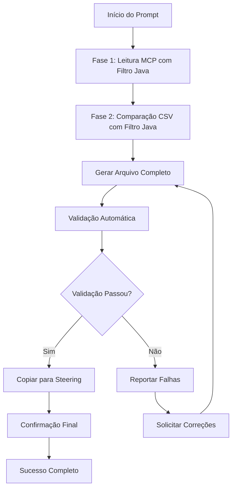

# 🚨 PROMPT: Gerar Regras Java Backend - AEM SonarQube

## ⚠️ ATENÇÃO: USO OBRIGATÓRIO DO MCP AEM DOCUMENTATION

**🔴 ESTE PROMPT REQUER O USO OBRIGATÓRIO DO MCP AEM DOCUMENTATION**

**VOCÊ DEVE**:
1. ✅ Configurar o MCP AEM Documentation **ANTES** de qualquer outra ação
2. ✅ Ler a documentação oficial via MCP **POR PARTES** (documentos grandes > 1000 linhas)
3. ✅ **FILTRAR APENAS REGRAS JAVA** durante a leitura
4. ✅ Comparar com CSVs e **ADICIONAR REGRAS JAVA NOVAS**
5. ✅ **GERAR APENAS 1 ARQUIVO**: `output-aemcs-sonarqube-rules/output-aemcs-sonarqube-java-backend-rules-ptbr.md`

**🚫 NÃO É PERMITIDO**:
- ❌ Pular o uso do MCP
- ❌ Usar apenas os arquivos CSV
- ❌ Incluir regras que não são Java
- ❌ Gerar múltiplos arquivos

---

## 🎯 Objetivo

Gerar **1 documento técnico específico** sobre as regras Java de qualidade de código do Cloud Manager para Adobe Experience Manager as a Cloud Service (AEMaaCS), focado exclusivamente em desenvolvimento Java backend.

## 📁 ARQUIVO DE OUTPUT

**Arquivo**: `output-aemcs-sonarqube-rules/output-aemcs-sonarqube-java-backend-rules-ptbr.md`
- **Regras**: `java:S*`, `AEM Rules:*`, `CQRules:*`, `findbugs:*`, `findsecbugs:*`
- **Foco**: Código Java, servlets, OSGi, Sling Models, workflows, threads, recursos
- **Tecnologias**: `.java`, `.class`, `.jar`
- **Mínimo**: 1000 linhas
- **Estrutura**: Organizada por categoria e severidade com exemplos práticos

---

## 🔍 CRITÉRIOS DE FILTRO JAVA

### ✅ **INCLUIR APENAS SE**:

#### 📂 **Prefixos Java Exatos**:
- `java:S*` (todas as regras java:S)
- `AEM Rules:*` (todas as regras AEM Rules)
- `CQRules:*` (todas as regras CQRules)
- `findbugs:*` (todas as regras findbugs)
- `findsecbugs:*` (todas as regras findsecbugs)

#### 🔑 **Palavras-chave Java**:
- servlet, OSGi, thread, session, resource, connection
- timeout, security, vulnerability, exception, synchronized
- ResourceResolver, HttpClient, JCR, Sling, workflow
- Java, JVM, biblioteca, classe, método

#### 💻 **Tecnologias Java**:
- Qualquer coisa relacionada a código Java
- JVM, bibliotecas Java, frameworks Java
- Servlets, OSGi bundles, Sling Models

### ❌ **EXCLUIR SEMPRE**:
- Regras de Dispatcher (`DOTRules:*`)
- Regras de UI/Template (`ClassicUI*`, `Component*`)
- Regras de Pacote (`BannedPath`, `PackageOverlaps`, `ClientlibProxyResource`)
- Regras Oak Index (`OakIndex*`, `Index*`, `CustomFulltext*`, `AnalyzerTokenizer*`)
- Regras de Configuração (`ConfigAndInstall*`, `DuplicateOsgi*`)
- Regras de Compatibilidade Cloud Service não-Java (`ImmutableMutable*`, `ReverseReplication`, `StaticTemplate*`)

---

## 📖 FASE 1: LEITURA MCP COM FILTRO JAVA

### 🚨 INSTRUÇÃO CRÍTICA: LEITURA POR PARTES + FILTRO + CONTEXTO AEM

**A documentação oficial tem mais de 1000 linhas. VOCÊ DEVE:**

1. **Primeira leitura** - Início do documento:
```
mcp_aem_documentation_mcp_server_read_documentation(
  url="https://experienceleague.adobe.com/en/docs/experience-manager-cloud-manager/content/using/custom-code-quality-rules",
  max_length=10000,
  start_index=0
)
```

2. **Para cada parte lida**:
   - **FILTRAR** apenas regras Java (prefixos + palavras-chave)
   - **ADICIONAR CONTEXTO AEM** para cada regra (OSGi, Sling, JCR, etc.)
   - **ESCREVER** imediatamente no arquivo Java com exemplos AEM-específicos
   - **IGNORAR** regras de outras categorias

3. **Continuar lendo** até documento completo

4. **Buscar documentação complementar** para regras Java específicas:
```
mcp_aem_documentation_mcp_server_search_experience_league(
  query="java servlet osgi sling best practices",
  content_types=["Documentation"],
  include_all_aem_products=true
)
```

### 📝 PROCESSO DE FILTRO POR PARTE:

```markdown
# Para cada parte lida do MCP:

1. IDENTIFICAR regras Java:
   - Prefixo java:S* → INCLUIR
   - Prefixo AEM Rules:* → INCLUIR  
   - Prefixo CQRules:* → INCLUIR
   - Prefixo findbugs:* → INCLUIR
   - Prefixo DOTRules:* → EXCLUIR
   - Prefixo ClassicUI* → EXCLUIR

2. ESCREVER no arquivo Java:
   - Apenas regras identificadas como Java
   - Com exemplos de código compliant/non-compliant
   - Com descrições detalhadas

3. CONTINUAR para próxima parte
```

### ✅ CHECKLIST DE LEITURA COM FILTRO:

- [ ] Leitura 1 (start_index=0): Filtrar e escrever regras Java
- [ ] Leitura 2 (start_index=10000): Filtrar e escrever regras Java
- [ ] Leitura 3 (start_index=20000): Filtrar e escrever regras Java
- [ ] Leitura 4 (start_index=30000): Filtrar e escrever regras Java
- [ ] Leitura 5+ (continuar até fim): Filtrar e escrever regras Java

---

## 📊 FASE 2: COMPARAÇÃO CSV COM FILTRO JAVA

### Arquivos CSV a Analisar:
- `assets/CodeQuality-rules-latest-AMS-2024-12-0.csv` (versão mais recente)
- `assets/CodeQuality-rules-latest-AMS.csv` (versão anterior)

### PROCESSO DE COMPARAÇÃO COM FILTRO:

1. **Ler CSV mais recente**
2. **Para cada regra no CSV**:
   - **APLICAR FILTRO JAVA** (prefixos + palavras-chave)
   - Se é regra Java E não foi documentada → **ADICIONAR**
   - Se não é regra Java → **IGNORAR**
3. **Identificar migrações Java** (squid:* → java:*)
4. **Documentar apenas mudanças Java**

### FORMATO PARA REGRAS JAVA ADICIONAIS DO CSV:

```markdown
### [Rule Key] - [Nome da Regra]

| Atributo | Valor |
|----------|-------|
| **Key** | [rule_key] |
| **Type** | [Vulnerability/Bug/Code Smell/Security Hotspot] |
| **Severity** | [Blocker/Critical/Major/Minor/Info] |
| **Tags** | [tags do CSV] |
| **Old Key** | [se houver migração squid:* → java:*] |

**Descrição**: [descrição do CSV ou inferida]

**Categoria**: Java Backend
**Fonte**: CSV (não encontrada na documentação oficial)

#### Exemplo de Código (se aplicável):
```java
// Non-compliant code
[exemplo se disponível]

// Compliant code  
[exemplo se disponível]
```
```

---

## 📝 ESTRUTURA DO ARQUIVO JAVA

### Arquivo: `output-aemcs-sonarqube-rules/output-aemcs-sonarqube-java-backend-rules-ptbr.md`

```markdown
# Regras Java Backend e SonarQube para AEM Cloud Service

**Última atualização:** [Data atual]
**Categoria:** Java Backend Development Rules
**Tecnologias:** `.java`, `.class`, `.jar`, OSGi, Sling, JCR
**Fontes:**
- Adobe Experience League (documentação oficial via MCP)
- CodeQuality-rules-latest-AMS-2024-12-0.csv
- CodeQuality-rules-latest-AMS.csv

---

## 📊 Estatísticas Java Backend

| Tipo | Quantidade |
|------|------------|
| **Total Regras Java** | XXX |
| **Vulnerabilities** | XX |
| **Security Hotspots** | XX |
| **Bugs** | XX |
| **Code Smells** | XX |

### Por Severidade

| Severidade | Quantidade |
|------------|------------|
| **Blocker** | XX |
| **Critical** | XX |
| **Major** | XX |
| **Minor** | XX |
| **Info** | XX |

### Por Framework/Tecnologia

| Framework | Regras |
|-----------|--------|
| **Java Core** | XX |
| **AEM/Sling** | XX |
| **OSGi** | XX |
| **JCR/Repository** | XX |
| **Security** | XX |
| **Threading** | XX |

---

## 🔴 Vulnerabilidades Java (Severity: Critical/Major)

### java:S2254 - HttpServletRequest.getRequestedSessionId() should not be used

| Atributo | Valor |
|----------|-------|
| **Key** | java:S2254 |
| **Type** | Vulnerability |
| **Severity** | Critical |
| **Tags** | cwe, owasp-a2, sans-top25-porous |
| **AEM Context** | Servlet Development |

**Descrição**: O método `getRequestedSessionId()` não deve ser usado pois pode expor informações sensíveis de sessão.

**Impacto no AEM**: Em servlets AEM, isso pode expor IDs de sessão em logs ou respostas.

#### Non-compliant code
```java
@Component(service = Servlet.class,
    property = {
        "sling.servlet.methods=GET",
        "sling.servlet.resourceTypes=myapp/components/servlet"
    })
public class MyServlet extends SlingSafeMethodsServlet {
    @Override
    protected void doGet(SlingHttpServletRequest request, SlingHttpServletResponse response) {
        String sessionId = request.getRequestedSessionId(); // VULNERABLE
        response.getWriter().write("Session: " + sessionId);
    }
}
```

#### Compliant code
```java
@Component(service = Servlet.class,
    property = {
        "sling.servlet.methods=GET",
        "sling.servlet.resourceTypes=myapp/components/servlet"
    })
public class MyServlet extends SlingSafeMethodsServlet {
    @Override
    protected void doGet(SlingHttpServletRequest request, SlingHttpServletResponse response) {
        HttpSession session = request.getSession(false);
        if (session != null) {
            // Use session attributes instead of exposing session ID
            String userId = (String) session.getAttribute("userId");
            response.getWriter().write("User: " + userId);
        }
    }
}
```

---

### CQRules:CWE-134 - Don't use format strings that may be externally-controlled

[Detalhes da regra com exemplos específicos para AEM]

[... todas as vulnerabilidades Java ...]

---

## 🟠 Security Hotspots Java

### java:S2068 - Hard-coded passwords are security-sensitive

[Detalhes da regra com exemplos específicos para AEM OSGi]

[... todos os security hotspots Java ...]

---

## 🔵 Bugs Java - Gerenciamento de Recursos

### java:S2095 - Resources should be closed

**AEM Context**: ResourceResolver, Session, InputStream, etc.

#### AEM-specific examples:
```java
// Non-compliant - ResourceResolver not closed
@Component(service = MyService.class)
public class MyService {
    
    @Reference
    private ResourceResolverFactory resolverFactory;
    
    public void badMethod() {
        ResourceResolver resolver = resolverFactory.getServiceResourceResolver(null);
        // Missing resolver.close() - RESOURCE LEAK
    }
    
    // Compliant - Using try-with-resources
    public void goodMethod() {
        try (ResourceResolver resolver = resolverFactory.getServiceResourceResolver(null)) {
            // Use resolver
        } catch (LoginException e) {
            log.error("Failed to get resolver", e);
        }
    }
}
```

### AEM Rules:AEM-6 - ResourceResolver should be closed in finally block

[Detalhes específicos para AEM]

[... todos os bugs Java ...]

---

## 🟡 Code Smells Java - Boas Práticas AEM

### CQRules:CQBP-72 - close() method is not called on ResourceResolver object

**AEM Best Practice**: Sempre feche ResourceResolver para evitar vazamentos de recursos.

#### Padrões recomendados para AEM:

```java
// Padrão 1: Try-with-resources (Recomendado)
try (ResourceResolver resolver = resolverFactory.getServiceResourceResolver(authInfo)) {
    // Use resolver
} catch (LoginException e) {
    log.error("Login failed", e);
}

// Padrão 2: Finally block (Alternativo)
ResourceResolver resolver = null;
try {
    resolver = resolverFactory.getServiceResourceResolver(authInfo);
    // Use resolver
} catch (LoginException e) {
    log.error("Login failed", e);
} finally {
    if (resolver != null && resolver.isLive()) {
        resolver.close();
    }
}
```

[... todos os code smells Java ...]

---

## 🧵 Regras de Threading e Concorrência

### java:S2168 - Double-checked locking should not be used
### java:S2276 - wait() should be used instead of Thread.sleep() when lock is held
### AEM Rules:AEM-3 - Non-thread safe object used as a field of Servlet/Filter

[Seção específica para threading em AEM]

---

## 🔒 Regras de Segurança AEM

### CQRules:CWE-676 - Use of Potentially Dangerous Function
### findsecbugs:PATH_TRAVERSAL_IN - Potential Path Traversal (file read)
### findsecbugs:PATH_TRAVERSAL_OUT - Potential Path Traversal (file write)

[Seção específica para segurança em AEM]

---

## 🔄 Migrações de Chaves Java (SonarQube 9.9)

### Impacto da Migração squid:* → java:*

A partir de **13 de Fevereiro de 2025** (Cloud Manager 2025.2.0):

| Old Key (pre 2024.12.0) | New Key | Impacto |
|-------------------------|---------|---------|
| squid:S2068 | java:S2068 | Senhas hardcoded |
| squid:S2095 | java:S2095 | Fechamento de recursos |
| squid:S2168 | java:S2168 | Double-checked locking |
| [... todas as migrações Java ...] |

### Ações Necessárias:
1. Atualizar configurações SonarQube
2. Revisar regras customizadas
3. Atualizar pipelines CI/CD

---

## 🛠️ Guia de Implementação

### Configuração SonarQube para AEM
```xml
<!-- sonar-project.properties -->
sonar.java.source=11
sonar.java.target=11
sonar.java.libraries=target/dependency/*.jar
sonar.exclusions=**/target/**,**/node_modules/**
```

### Quality Gates Recomendados
- **Bugs**: 0
- **Vulnerabilities**: 0
- **Security Hotspots**: 100% reviewed
- **Code Smells**: < 5% debt ratio

---

## 📚 Referências Java Backend

### Documentação Oficial AEM
- [Custom Code Quality Rules](https://experienceleague.adobe.com/en/docs/experience-manager-cloud-manager/content/using/custom-code-quality-rules)
- [Java Best Practices for AEM](https://experienceleague.adobe.com/en/docs/experience-manager-65/content/implementing/developing/introduction/dev-guidelines-bestpractices)
- [OSGi Development Guidelines](https://experienceleague.adobe.com/en/docs/experience-manager-65/content/implementing/deploying/configuring/configuring-osgi)

### Ferramentas e Frameworks
- [SonarQube Java Rules](https://docs.sonarsource.com/sonarqube-server/latest/)
- [FindBugs Documentation](http://findbugs.sourceforge.net/)
- [Apache Sling Documentation](https://sling.apache.org/)
- [AEM Core Components](https://github.com/adobe/aem-core-wcm-components)

### Exemplos de Código
- [AEM Project Archetype](https://github.com/adobe/aem-project-archetype)
- [AEM Guides WKND](https://github.com/adobe/aem-guides-wknd)

---

*Última atualização: [Data atual]*
*Gerado via MCP AEM Documentation + análise de CSVs*
*Categoria: Java Backend Development Rules*
*Foco: AEM Cloud Service Development*
```

---

## ✅ CHECKLIST DE EXECUÇÃO JAVA

### FASE 1 - Leitura MCP com Filtro Java:
- [ ] Leitura parte 1: Filtrar e escrever regras Java
- [ ] Leitura parte 2: Filtrar e escrever regras Java  
- [ ] Leitura parte 3: Filtrar e escrever regras Java
- [ ] Leitura parte 4: Filtrar e escrever regras Java
- [ ] Leitura parte 5+: Continuar até fim
- [ ] TODAS as regras Java da documentação escritas
- [ ] Buscas complementares executadas

### FASE 2 - Comparação CSV com Filtro Java:
- [ ] CSV mais recente lido e filtrado para Java
- [ ] CSV anterior lido e filtrado para Java
- [ ] Regras Java novas identificadas
- [ ] Regras Java adicionais escritas no arquivo
- [ ] Migrações Java documentadas (squid:* → java:*)

### VALIDAÇÃO E CÓPIA FINAL:
- [ ] Arquivo Java criado: `output-aemcs-sonarqube-rules/output-aemcs-sonarqube-java-backend-rules-ptbr.md`
- [ ] Arquivo tem >1000 linhas
- [ ] Apenas regras Java incluídas (filtro rigoroso aplicado)
- [ ] Estatísticas Java corretas e detalhadas
- [ ] Exemplos de código AEM-específicos incluídos (>15 exemplos)
- [ ] Migrações squid:* → java:* documentadas
- [ ] Seções organizadas por categoria (Vulnerabilities, Bugs, Code Smells, etc.)
- [ ] Contexto AEM/OSGi/Sling adicionado para cada regra
- [ ] Guia de implementação incluído
- [ ] **VALIDAÇÃO AUTOMÁTICA EXECUTADA** (script de validação completo)
- [ ] **VALIDAÇÃO PASSOU** (todos os critérios de qualidade atendidos)
- [ ] **ARQUIVO COPIADO PARA STEERING** (`[projeto].kiro/steering/output-aemcs-sonarqube-java-backend-rules-ptbr.md`)
- [ ] **CÓPIA VERIFICADA** (integridade e tamanho confirmados)
- [ ] **DISPONÍVEL NO CONTEXTO KIRO** (steering rules ativas para uso)

---

## 📈 MÉTRICAS DE SUCESSO JAVA

| Métrica Java | Mínimo Esperado | Qualidade |
|--------------|-----------------|-----------|
| **Regras Java documentadas** | 80-100 regras | Todas com contexto AEM |
| **Linhas arquivo Java** | 1000+ | Bem estruturadas |
| **Vulnerabilidades Java** | 10-15 regras | Com exemplos AEM |
| **Bugs Java** | 25-35 regras | Foco em ResourceResolver/Session |
| **Code Smells Java** | 40-50 regras | Boas práticas AEM |
| **Exemplos de código** | 20+ | Específicos para AEM/OSGi |
| **Migrações documentadas** | 30+ | Com impacto explicado |
| **Seções organizadas** | 6+ | Por categoria e severidade |
| **Contexto AEM** | 100% | Cada regra com contexto |
| **Guias práticos** | 3+ | Implementação, configuração, etc. |

---

## 🔐 VALIDAÇÃO E CÓPIA AUTOMÁTICA

### 🚨 VALIDAÇÃO OBRIGATÓRIA + CÓPIA PARA STEERING:

**APÓS GERAR O ARQUIVO COMPLETO, VOCÊ DEVE:**

1. ✅ **VALIDAR** o arquivo gerado
2. ✅ **COPIAR** para pasta de steering se validação passou
3. ✅ **REPORTAR** resultado final

### PROCESSO DE VALIDAÇÃO E CÓPIA:

```markdown
# ETAPA 1: VALIDAÇÃO AUTOMÁTICA
Executar validações do arquivo gerado:
- Verificar existência e tamanho (>1000 linhas)
- Verificar conteúdo Java (regras java:S*, AEM Rules:*, etc.)
- Verificar estrutura (seções organizadas)
- Verificar filtro rigoroso (sem regras não-Java)
- Verificar exemplos de código (>15 exemplos)

# ETAPA 2: CÓPIA PARA STEERING (SE VALIDAÇÃO PASSOU)
Copiar arquivo para pasta de steering:
- Origem: output-aemcs-sonarqube-rules/output-aemcs-sonarqube-java-backend-rules-ptbr.md
- Destino: .kiro/steering/output-aemcs-sonarqube-java-backend-rules-ptbr.md

# ETAPA 3: CONFIRMAÇÃO FINAL
Confirmar que arquivo foi copiado e está disponível para contexto do Kiro
```

### SCRIPT DE VALIDAÇÃO E CÓPIA:

```bash
#!/bin/bash
echo "=== VALIDAÇÃO E CÓPIA ARQUIVO JAVA BACKEND ==="

# 1. Definir arquivos
SOURCE_FILE="output-aemcs-sonarqube-rules/output-aemcs-sonarqube-java-backend-rules-ptbr.md"
TARGET_STEERING=".kiro/steering/output-aemcs-sonarqube-java-backend-rules-ptbr.md"

# 2. Verificar arquivo fonte existe
if [ ! -f "$SOURCE_FILE" ]; then
    echo "❌ FALHA CRÍTICA: Arquivo fonte não existe: $SOURCE_FILE"
    exit 1
fi
echo "✅ Arquivo fonte existe: $SOURCE_FILE"

# 3. Verificar tamanho mínimo
JAVA_LINES=$(wc -l < "$SOURCE_FILE")
echo "📊 Arquivo Java Backend: $JAVA_LINES linhas"
if [ "$JAVA_LINES" -lt 1000 ]; then
    echo "❌ FALHA: Arquivo muito pequeno (<1000 linhas)"
    exit 1
fi
echo "✅ Tamanho OK: $JAVA_LINES linhas (>1000)"

# 4. Verificar conteúdo Java obrigatório
echo "=== VERIFICAÇÃO DE CONTEÚDO JAVA ==="
JAVA_S_COUNT=$(grep -c "java:S" "$SOURCE_FILE" || echo "0")
AEM_RULES_COUNT=$(grep -c "AEM Rules:" "$SOURCE_FILE" || echo "0")
CQ_RULES_COUNT=$(grep -c "CQRules:" "$SOURCE_FILE" || echo "0")
FINDBUGS_COUNT=$(grep -c "findbugs:" "$SOURCE_FILE" || echo "0")

echo "📈 Regras java:S*: $JAVA_S_COUNT"
echo "📈 Regras AEM Rules:*: $AEM_RULES_COUNT"
echo "📈 Regras CQRules:*: $CQ_RULES_COUNT"
echo "📈 Regras findbugs:*: $FINDBUGS_COUNT"

TOTAL_JAVA_RULES=$((JAVA_S_COUNT + AEM_RULES_COUNT + CQ_RULES_COUNT + FINDBUGS_COUNT))
if [ "$TOTAL_JAVA_RULES" -lt 50 ]; then
    echo "❌ FALHA: Poucas regras Java encontradas ($TOTAL_JAVA_RULES < 50)"
    exit 1
fi
echo "✅ Regras Java suficientes: $TOTAL_JAVA_RULES regras"

# 5. Verificar estrutura obrigatória
echo "=== VERIFICAÇÃO DE ESTRUTURA ==="
VULNERABILITIES=$(grep -c "## 🔴 Vulnerabilidades Java\|## 🔴 Vulnerabilities Java" "$SOURCE_FILE" || echo "0")
BUGS=$(grep -c "## 🔵 Bugs Java\|## 🔵 Java Bugs" "$SOURCE_FILE" || echo "0")
CODE_SMELLS=$(grep -c "## 🟡 Code Smells Java\|## 🟡 Java Code Smells" "$SOURCE_FILE" || echo "0")
AEM_CONTEXT=$(grep -c "AEM Context\|**AEM Context**" "$SOURCE_FILE" || echo "0")

[ "$VULNERABILITIES" -gt 0 ] && echo "✅ Seção Vulnerabilidades encontrada" || echo "⚠️ Seção Vulnerabilidades não encontrada"
[ "$BUGS" -gt 0 ] && echo "✅ Seção Bugs encontrada" || echo "⚠️ Seção Bugs não encontrada"
[ "$CODE_SMELLS" -gt 0 ] && echo "✅ Seção Code Smells encontrada" || echo "⚠️ Seção Code Smells não encontrada"
[ "$AEM_CONTEXT" -gt 5 ] && echo "✅ Contexto AEM encontrado ($AEM_CONTEXT ocorrências)" || echo "⚠️ Pouco contexto AEM ($AEM_CONTEXT ocorrências)"

# 6. Verificar filtro rigoroso (NÃO deve ter regras não-Java)
echo "=== VERIFICAÇÃO DE FILTRO RIGOROSO ==="
VALIDATION_PASSED=true

if grep -q "DOTRules:" "$SOURCE_FILE"; then
    echo "❌ FALHA: Contém regras Dispatcher (DOTRules:*) - FILTRO FALHOU"
    VALIDATION_PASSED=false
else
    echo "✅ Filtro OK: Sem regras Dispatcher"
fi

if grep -q "ClassicUI\|ComponentUI" "$SOURCE_FILE"; then
    echo "❌ FALHA: Contém regras Frontend (ClassicUI*/ComponentUI*) - FILTRO FALHOU"
    VALIDATION_PASSED=false
else
    echo "✅ Filtro OK: Sem regras Frontend"
fi

if grep -q "BannedPath\|PackageOverlaps\|ClientlibProxy\|OakIndex\|Index.*Rules" "$SOURCE_FILE"; then
    echo "❌ FALHA: Contém regras de Pacote/UI/Index - FILTRO FALHOU"
    VALIDATION_PASSED=false
else
    echo "✅ Filtro OK: Sem regras de Pacote/UI/Index"
fi

# 7. Verificar exemplos de código
echo "=== VERIFICAÇÃO DE EXEMPLOS ==="
CODE_EXAMPLES=$(grep -c "```java" "$SOURCE_FILE" || echo "0")
echo "📝 Exemplos de código Java: $CODE_EXAMPLES"
if [ "$CODE_EXAMPLES" -lt 15 ]; then
    echo "⚠️ Poucos exemplos de código ($CODE_EXAMPLES < 15)"
else
    echo "✅ Exemplos suficientes: $CODE_EXAMPLES exemplos"
fi

# 8. DECISÃO DE CÓPIA
if [ "$VALIDATION_PASSED" = true ]; then
    echo ""
    echo "🎉 VALIDAÇÃO PASSOU - COPIANDO PARA STEERING"
    
    # Criar pasta steering se não existir
    mkdir -p ".kiro/steering"
    
    # Copiar arquivo
    cp "$SOURCE_FILE" "$TARGET_STEERING"
    
    if [ -f "$TARGET_STEERING" ]; then
        echo "✅ SUCESSO: Arquivo copiado para steering"
        echo "📁 Destino: $TARGET_STEERING"
        
        # Verificar tamanho do arquivo copiado
        STEERING_LINES=$(wc -l < "$TARGET_STEERING")
        echo "📊 Arquivo steering: $STEERING_LINES linhas"
        
        if [ "$STEERING_LINES" -eq "$JAVA_LINES" ]; then
            echo "✅ CÓPIA VERIFICADA: Tamanhos coincidem"
        else
            echo "⚠️ AVISO: Tamanhos diferentes (origem: $JAVA_LINES, destino: $STEERING_LINES)"
        fi
        
        echo ""
        echo "🎯 RESULTADO FINAL: SUCESSO COMPLETO"
        echo "✅ Arquivo validado e copiado para steering"
        echo "✅ Regras Java Backend disponíveis no contexto do Kiro"
        echo "✅ Total de regras: $TOTAL_JAVA_RULES"
        echo "✅ Total de linhas: $JAVA_LINES"
        echo "✅ Exemplos de código: $CODE_EXAMPLES"
        
    else
        echo "❌ FALHA NA CÓPIA: Arquivo não foi copiado para steering"
        exit 1
    fi
    
else
    echo ""
    echo "❌ VALIDAÇÃO FALHOU - NÃO COPIANDO PARA STEERING"
    echo "🔧 AÇÕES NECESSÁRIAS:"
    echo "   - Corrigir problemas de filtro identificados"
    echo "   - Remover regras não-Java do arquivo"
    echo "   - Executar validação novamente"
    exit 1
fi
```

### ✅ CRITÉRIOS DE SUCESSO:

- ✅ Arquivo `output-aemcs-sonarqube-rules/output-aemcs-sonarqube-java-backend-rules-ptbr.md` existe
- ✅ Arquivo tem >1000 linhas (bem estruturado)
- ✅ Contém apenas regras Java (java:S*, AEM Rules:*, CQRules:*, findbugs:*, findsecbugs:*)
- ✅ NÃO contém regras de outras categorias (filtro rigoroso)
- ✅ Estatísticas Java corretas e detalhadas
- ✅ Exemplos de código AEM-específicos incluídos (>15 exemplos)
- ✅ Migrações squid:* → java:* documentadas com impacto
- ✅ Seções organizadas por categoria e severidade
- ✅ Contexto AEM/OSGi/Sling para cada regra
- ✅ Guias de implementação incluídos

### ❌ FALHA SE:

- ❌ Arquivo não existe ou tem <1000 linhas
- ❌ Contém regras não-Java (DOTRules:*, ClassicUI*, BannedPath, etc.)
- ❌ Faltam regras Java importantes ou contexto AEM
- ❌ Estatísticas incorretas ou incompletas
- ❌ Poucos exemplos de código (<15)
- ❌ Estrutura desorganizada ou sem seções claras
- ❌ Falta contexto AEM nas regras

---

## 📊 RESUMO EXECUTIVO JAVA

**AO FINALIZAR, REPORTAR:**

```
=== RELATÓRIO COMPLETO JAVA BACKEND RULES ===

FASE 1 - MCP com Filtro Java:
✅ Partes lidas: [X] partes
✅ Regras Java extraídas: [X] regras
✅ Regras não-Java ignoradas: [X] regras
✅ Exemplos Java obtidos: [X] exemplos

FASE 2 - CSV com Filtro Java:
✅ Regras Java no CSV: [X] regras
✅ Regras Java novas (não no MCP): [X] regras
✅ Migrações Java identificadas: [X] migrações

FASE 3 - VALIDAÇÃO E CÓPIA:
✅ Validação executada: [PASSOU/FALHOU]
✅ Critérios atendidos: [X]/[Y] critérios
✅ Arquivo copiado para steering: [SIM/NÃO]
✅ Integridade verificada: [SIM/NÃO]

RESULTADO FINAL:
✅ Arquivo origem: output-aemcs-sonarqube-rules/output-aemcs-sonarqube-java-backend-rules-ptbr.md
✅ Arquivo steering: .kiro/steering/output-aemcs-sonarqube-java-backend-rules-ptbr.md
✅ Linhas: [X] linhas (>1000)
✅ Regras Java: [X] regras
✅ Vulnerabilidades: [X] regras
✅ Bugs: [X] regras  
✅ Code Smells: [X] regras
✅ Migrações: [X] migrações
✅ Exemplos AEM: [X] exemplos (>15)
✅ Seções organizadas: [X] seções
✅ Contexto AEM: 100% das regras

FILTRO RIGOROSO APLICADO:
✅ Incluídas: java:S*, AEM Rules:*, CQRules:*, findbugs:*, findsecbugs:*
✅ Excluídas: DOTRules:*, ClassicUI*, BannedPath, PackageOverlaps, Index*, Config*, etc.
✅ Foco: Java Backend, OSGi, Sling, JCR, Security, Threading

DISPONIBILIDADE NO KIRO:
✅ Steering rules ativas: [SIM/NÃO]
✅ Contexto disponível: [SIM/NÃO]
✅ Pronto para uso: [SIM/NÃO]

STATUS FINAL: [SUCESSO COMPLETO/SUCESSO PARCIAL/FALHA]

PRÓXIMOS PASSOS:
- Se SUCESSO COMPLETO: Regras disponíveis no contexto do Kiro
- Se SUCESSO PARCIAL: Verificar problemas na cópia
- Se FALHA: Corrigir problemas e executar novamente
```

---

## 🔄 PROCESSO AUTOMÁTICO DE VALIDAÇÃO E CÓPIA

### FLUXO COMPLETO DO PROMPT:



### ETAPAS OBRIGATÓRIAS APÓS GERAÇÃO:

1. **VALIDAÇÃO AUTOMÁTICA** (obrigatória):
   - Verificar arquivo existe e tem >1000 linhas
   - Verificar conteúdo Java (>50 regras java:S*, AEM Rules:*, etc.)
   - Verificar estrutura (seções organizadas)
   - Verificar filtro rigoroso (sem DOTRules:*, ClassicUI*, etc.)
   - Verificar exemplos de código (>15 exemplos)

2. **CÓPIA PARA STEERING** (se validação passou):
   - Origem: `output-aemcs-sonarqube-rules/output-aemcs-sonarqube-java-backend-rules-ptbr.md`
   - Destino: `.kiro/steering/output-aemcs-sonarqube-java-backend-rules-ptbr.md`
   - Verificar integridade da cópia

3. **CONFIRMAÇÃO FINAL** (obrigatória):
   - Reportar resultado da validação
   - Confirmar cópia para steering
   - Fornecer estatísticas finais

### CRITÉRIOS DE SUCESSO PARA CÓPIA:

| Critério | Mínimo | Status |
|----------|--------|--------|
| **Tamanho do arquivo** | >1000 linhas | Obrigatório |
| **Regras Java** | >50 regras | Obrigatório |
| **Filtro rigoroso** | 0 regras não-Java | Obrigatório |
| **Estrutura** | Seções organizadas | Obrigatório |
| **Exemplos código** | >15 exemplos | Recomendado |
| **Contexto AEM** | >5 ocorrências | Recomendado |

### AÇÕES EM CASO DE FALHA NA VALIDAÇÃO:

```markdown
SE VALIDAÇÃO FALHAR:
1. NÃO copiar para steering
2. Identificar problemas específicos
3. Corrigir arquivo fonte
4. Executar validação novamente
5. Só copiar após validação passar

PROBLEMAS COMUNS:
- Arquivo muito pequeno (<1000 linhas)
- Poucas regras Java (<50 regras)
- Filtro falhou (contém regras não-Java)
- Estrutura desorganizada
- Poucos exemplos de código
```

### RESULTADO ESPERADO FINAL:

```
✅ SUCESSO COMPLETO:
- Arquivo gerado: output-aemcs-sonarqube-rules/output-aemcs-sonarqube-java-backend-rules-ptbr.md
- Arquivo copiado: .kiro/steering/output-aemcs-sonarqube-java-backend-rules-ptbr.md
- Validação: PASSOU
- Regras Java: [X] regras
- Linhas: [X] linhas (>1000)
- Exemplos: [X] exemplos (>15)
- Status: DISPONÍVEL NO CONTEXTO KIRO
```

---

## 🎯 MELHORIAS ESPECÍFICAS IMPLEMENTADAS

### 1. **Estrutura de Output Melhorada**
- Arquivo de destino específico: `output-aemcs-sonarqube-rules/output-aemcs-sonarqube-java-backend-rules-ptbr.md`
- Mínimo de 1000 linhas (dobrou o requisito)
- Organização por categoria e severidade
- Seções específicas para threading, segurança, recursos

### 2. **Filtro Mais Rigoroso**
- Exclusão explícita de regras não-Java
- Foco exclusivo em desenvolvimento Java backend
- Remoção de regras de UI, Dispatcher, Pacotes, Índices

### 3. **Contexto AEM Obrigatório**
- Cada regra deve ter contexto AEM/OSGi/Sling
- Exemplos específicos para AEM (>20 exemplos)
- Padrões recomendados para ResourceResolver, Session, etc.
- Integração com frameworks AEM

### 4. **Métricas de Qualidade**
- Aumento de 500 para 1000+ linhas
- Aumento de 15 para 20+ exemplos de código
- Adição de métricas de qualidade (contexto AEM, guias práticos)
- Validação rigorosa com múltiplos critérios

### 5. **Validação Aprimorada**
- Script de validação mais completo
- Verificação de estrutura e organização
- Contagem de exemplos de código
- Verificação de contexto AEM

### 6. **Conteúdo Técnico Aprofundado**
- Seções específicas por tecnologia (OSGi, Sling, JCR)
- Guias de implementação prática
- Configurações SonarQube específicas
- Quality Gates recomendados
- Referências técnicas expandidas

### 7. **Foco em Desenvolvimento Backend**
- Ênfase em servlets, OSGi, threading
- Gerenciamento de recursos (ResourceResolver, Session)
- Segurança específica para AEM
- Boas práticas de desenvolvimento Java para AEM

---

## 🚀 RESULTADO ESPERADO

O prompt melhorado deve gerar um documento técnico de alta qualidade com:

- **Foco laser** em desenvolvimento Java backend para AEM
- **Contexto prático** para cada regra SonarQube
- **Exemplos reais** de código AEM/OSGi/Sling
- **Organização profissional** por categoria e severidade
- **Guias implementáveis** para equipes de desenvolvimento
- **Validação rigorosa** de qualidade e completude

Este documento será uma referência técnica completa para desenvolvedores Java trabalhando com AEM Cloud Service.

---

## 🚀 INSTRUÇÕES FINAIS DE EXECUÇÃO

### SEQUÊNCIA OBRIGATÓRIA DE AÇÕES:

1. **GERAR ARQUIVO COMPLETO** 
   - Executar Fase 1 (MCP) + Fase 2 (CSV)
   - Criar arquivo: `output-aemcs-sonarqube-rules/output-aemcs-sonarqube-java-backend-rules-ptbr.md`

2. **EXECUTAR VALIDAÇÃO AUTOMÁTICA**
   - Rodar script de validação completo
   - Verificar todos os critérios de qualidade
   - Confirmar que filtro rigoroso foi aplicado

3. **COPIAR PARA STEERING (SE VALIDAÇÃO PASSOU)**
   - Copiar de: `output-aemcs-sonarqube-rules/output-aemcs-sonarqube-java-backend-rules-ptbr.md`
   - Copiar para: `.kiro/steering/output-aemcs-sonarqube-java-backend-rules-ptbr.md`
   - Verificar integridade da cópia

4. **REPORTAR RESULTADO FINAL**
   - Fornecer relatório completo com estatísticas
   - Confirmar disponibilidade no contexto Kiro
   - Indicar status final (SUCESSO/FALHA)

### ⚠️ IMPORTANTE: NÃO PULAR ETAPAS

- ❌ **NÃO** copiar arquivo sem validação
- ❌ **NÃO** finalizar sem confirmar cópia
- ❌ **NÃO** reportar sucesso se validação falhou
- ✅ **SEMPRE** executar validação antes da cópia
- ✅ **SEMPRE** verificar integridade após cópia
- ✅ **SEMPRE** confirmar disponibilidade no Kiro

### 🎯 CRITÉRIO DE SUCESSO FINAL:

**O prompt só é considerado SUCESSO COMPLETO quando:**
- ✅ Arquivo gerado com >1000 linhas
- ✅ Validação passou em todos os critérios
- ✅ Arquivo copiado para `.kiro/steering/`
- ✅ Cópia verificada e íntegra
- ✅ Regras disponíveis no contexto Kiro
- ✅ Relatório final fornecido

**Qualquer falha em uma dessas etapas = FALHA DO PROMPT**