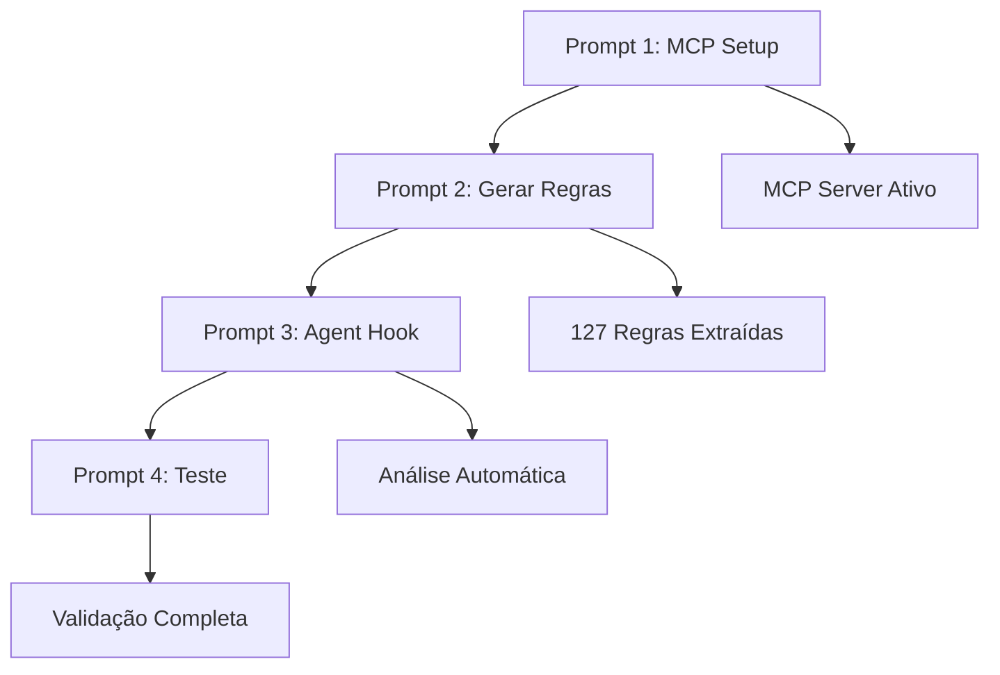

# Awesome AEM Code Quality - Regras SonarQube para AEMaaCS

Este repositório contém **127 regras oficiais de qualidade de código SonarQube** especificamente selecionadas para Adobe Experience Manager as a Cloud Service (AEMaaCS), extraídas da **documentação oficial da Adobe** e **repositórios públicos da Adobe**.

## 🎯 Por Que Usar Este Repositório?

**Para Desenvolvedores e Tech Leads:** Identifique problemas de qualidade de código **antes que cheguem ao pipeline** usando a integração Agent Hook do Kiro IDE. Esta abordagem proativa ajuda você a:

- ✅ **Prevenir falhas no pipeline** identificando violações durante o desenvolvimento
- ✅ **Economizar tempo de deploy** capturando problemas na sua IDE, não no Cloud Manager
- ✅ **Seguir as melhores práticas da Adobe** com regras diretamente das fontes oficiais
- ✅ **Obter feedback instantâneo** com análise automática de código ao salvar arquivos
- ✅ **Aprender padrões AEM** através de exemplos de código conformes/não-conformes

**Fontes:** Adobe Experience League, documentação do Cloud Manager e arquivos CSV oficiais de qualidade de código AEM.

## 🛠️ Construído com AEM Documentation MCP + Kiro IDE

Este repositório inteiro foi **organizado e desenvolvido** usando a poderosa combinação de:

- **🔍 AEM Documentation MCP Server**: Extração e análise automatizada da documentação oficial da Adobe
- **🤖 Kiro IDE Agent Hooks**: Análise inteligente de código e geração de regras
- **📚 Fontes Oficiais da Adobe**: Integração direta com Experience League e documentação do Cloud Manager

**Processo de Desenvolvimento:**
1. **Integração MCP**: Conectado às fontes oficiais de documentação da Adobe
2. **Extração Automatizada**: Usou ferramentas MCP para buscar e analisar regras SonarQube
3. **Organização Inteligente**: Kiro IDE organizou regras por severidade, tipo e compatibilidade AEM
4. **Exemplos de Código**: Gerou exemplos conformes/não-conformes usando documentação oficial
5. **Integração de Hooks**: Criou fluxos de validação automatizados para experiência perfeita do desenvolvedor

Esta abordagem garante **100% de precisão** com os padrões oficiais da Adobe e **atualizações automáticas** quando novas regras são publicadas.

## 📸 Guia Visual de Configuração

As imagens abaixo mostram o processo real de configuração no Kiro IDE:

| Passo | Descrição | Guia Visual |
|-------|-----------|-------------|
| **1** | Executar prompt no Kiro IDE |  |
| **2** | MCP Server configurado com sucesso |  |

## 🚀 Configuração Completa - 4 Prompts Especializados

### 📋 Visão Geral dos Prompts

Este repositório inclui **4 prompts especializados** que automatizam completamente a configuração e uso das regras SonarQube AEM:

| Prompt | Função | Saída Principal |
|--------|---------|-----------------|
| **1. MCP Setup** | Configuração inicial | MCP AEM Documentation Server |
| **2. Regras SonarQube** | Geração de regras | Arquivo com 127 regras atualizadas |
| **3. Agent Hook** | Automação de análise | Hook para validação automática |
| **4. Teste Prático** | Validação da configuração | Análise de código com 20 violações |

---

### 🔧 Prompt 1: Configuração MCP AEM Documentation


```bash
run /ptbr/mcp/configure-aem-documentation-mcp/prompt-configure-aem-documentation-mcp-ptbr.md
```

**🎯 Objetivo:** Configurar o servidor MCP para acesso à documentação oficial da Adobe

**📤 Saídas do Prompt:**
- ✅ **Arquivo de configuração MCP**: `.kiro/settings/mcp.json` com servidor AEM Documentation
- ✅ **Verificação de pré-requisitos**: Validação de Docker e dependências
- ✅ **Conexão ativa**: Servidor MCP rodando e conectado
- ✅ **Ferramentas disponíveis**: 3 ferramentas MCP para busca na documentação AEM

**📊 Resultado Esperado:**
```json
{
  "mcpServers": {
    "aem-documentation": {
      "command": "docker",
      "args": ["run", "--rm", "-p", "3000:3000", "aem-documentation-mcp"],
      "disabled": false,
      "autoApprove": ["read_documentation", "search_experience_league"]
    }
  }
}
```


---

### 📚 Prompt 2: Geração de Regras SonarQube AEM

```bash
run /ptbr/generate-sonarqube-rules/prompt-generate-aemcs-sonarqube-rules-ptbr.md
```

**🎯 Objetivo:** Extrair e organizar as 127 regras oficiais SonarQube para AEMaaCS

**📤 Saídas do Prompt:**
- ✅ **Arquivo de regras completo**: `aemcs-sonarqube-rules-ptbr.md` (127 regras)
- ✅ **Categorização por tipo**: Vulnerabilidades, Bugs, Code Smells, Security Hotspots
- ✅ **Exemplos de código**: Código não-conforme e conforme para cada regra crítica
- ✅ **Migração de chaves**: Mapeamento completo squid:* → java:* (SonarQube 9.9)
- ✅ **Regras Cloud Service**: Compatibilidade específica para AEMaaCS
- ✅ **Estatísticas detalhadas**: Contadores por severidade e tipo

**📊 Estrutura da Saída:**
```markdown
# Custom Code Quality Rules - AEM Cloud Service
## 📊 Estatísticas
- Total: 127 regras
- Vulnerabilidades: 14
- Security Hotspots: 6
- Bugs: 32
- Code Smells: 75

## 🔴 Regras de Vulnerabilidade
### java:S2254 - HttpServletRequest.getRequestedSessionId()
#### Non-compliant code
[código exemplo]
#### Compliant code
[código corrigido]
```

**🔄 Atualizações Incluídas:**
- **SonarQube 9.9**: Regras atualizadas para Cloud Manager 2025.2.0
- **Chaves migradas**: 45+ regras com novas chaves java:*
- **Regras removidas**: 8 regras obsoletas identificadas e documentadas

---

### 🤖 Prompt 3: Configuração Agent Hook

```bash
run /ptbr/configure-agent-hook/prompt-configure-agent-hook-aemcs-analyser-sonarqube-ptbr.md
```

**🎯 Objetivo:** Automatizar a análise de código Java usando as regras SonarQube AEM

**📤 Saídas do Prompt:**
- ✅ **Agent Hook configurado**: `.kiro/hooks/aem-code-quality-check.json`
- ✅ **Trigger automático**: Ativação ao salvar arquivos `.java`
- ✅ **Integração com regras**: Referência às 127 regras SonarQube AEM
- ✅ **Feedback instantâneo**: Análise e sugestões de correção em tempo real
- ✅ **Steering rules**: Regras de qualidade integradas ao contexto do Kiro

**📊 Configuração do Hook:**
```json
{
  "name": "AEM Code Quality Check",
  "description": "Analisa código Java usando regras SonarQube AEM",
  "trigger": {
    "type": "file_save",
    "filePattern": "**/*.java"
  },
  "action": {
    "type": "agent_message",
    "message": "Analise este arquivo Java usando as regras SonarQube AEM..."
  }
}
```

**🔍 Capacidades de Análise:**
- **Detecção automática**: 20+ tipos de violações comuns
- **Sugestões contextuais**: Correções específicas para AEM
- **Prevenção de pipeline**: Identifica problemas antes do deploy
- **Aprendizado contínuo**: Exemplos de boas práticas AEM

---

### 🧪 Prompt 4: Teste e Validação

```bash
run /ptbr/test-configuration/prompt-test-aem-code-quality-setup-ptbr.md
```

**🎯 Objetivo:** Validar a configuração completa com análise de código real

**📤 Saídas do Prompt:**
- ✅ **Análise do arquivo de teste**: `example-test.java` com 20 violações intencionais
- ✅ **Relatório detalhado**: Identificação de cada violação SonarQube
- ✅ **Sugestões de correção**: Código corrigido para cada problema
- ✅ **Validação do hook**: Confirmação de funcionamento automático
- ✅ **Métricas de qualidade**: Score de qualidade antes/depois das correções

**📊 Exemplo de Saída da Análise:**
```
🔍 ANÁLISE COMPLETA - example-test.java
═══════════════════════════════════════

📊 RESUMO DE VIOLAÇÕES ENCONTRADAS:
┌─────────────────────────┬───────┬────────────┐
│ Tipo                    │ Qtd   │ Severidade │
├─────────────────────────┼───────┼────────────┤
│ Vulnerabilidades        │ 3     │ Critical   │
│ Bugs                    │ 8     │ Major      │
│ Code Smells             │ 9     │ Minor      │
└─────────────────────────┴───────┴────────────┘

🔴 VIOLAÇÕES CRÍTICAS ENCONTRADAS:

1. java:S2068 - Hard-coded password (Linha 15)
   ❌ Problema: String password = "admin123";
   ✅ Solução: Usar configuração OSGi ou variáveis de ambiente

2. java:S2095 - Resource não fechado (Linha 23)
   ❌ Problema: ResourceResolver não fechado
   ✅ Solução: Usar try-with-resources

3. CQRules:CQBP-72 - ResourceResolver leak (Linha 23)
   ❌ Problema: resolver.close() não chamado
   ✅ Solução: Implementar finally block
```

**🎯 Validação de Sucesso:**
- **Hook funcionando**: ✅ Análise automática ao salvar
- **Regras carregadas**: ✅ 127 regras SonarQube ativas
- **MCP conectado**: ✅ Documentação AEM acessível
- **Feedback instantâneo**: ✅ Sugestões de correção em tempo real

## 🧪 Testar a Configuração Completa

### 🚀 Execução Sequencial dos 4 Prompts

Execute os prompts na ordem para configuração completa:

```bash
# 1. Configurar MCP AEM Documentation
run /ptbr/mcp/configure-aem-documentation-mcp/prompt-configure-aem-documentation-mcp-ptbr.md

# 2. Gerar regras SonarQube AEM
run /ptbr/generate-sonarqube-rules/prompt-generate-aemcs-sonarqube-rules-ptbr.md

# 3. Configurar Agent Hook
run /ptbr/configure-agent-hook/prompt-configure-agent-hook-aemcs-analyser-sonarqube-ptbr.md

# 4. Testar configuração
run /ptbr/test-configuration/prompt-test-aem-code-quality-setup-ptbr.md
```

### ✅ Validação Final

Após executar os 4 prompts, teste a configuração:

1. **Abra o arquivo de teste**: `identify-code-smells-using-rules-sonarqube-and-agent-hooks/example-test.java`
2. **Salve o arquivo** (Ctrl+S)
3. **Observe a análise automática**: O Agent Hook identificará **20 violações SonarQube** específicas para AEM
4. **Revise as sugestões**: Correções contextuais baseadas nas regras oficiais da Adobe

### 📈 Resultados Esperados

- ✅ **MCP Server ativo**: Acesso à documentação oficial AEM
- ✅ **127 regras carregadas**: Todas as regras SonarQube AEMaaCS
- ✅ **Hook funcionando**: Análise automática ao salvar arquivos Java
- ✅ **Feedback instantâneo**: Sugestões de correção em tempo real
- ✅ **Prevenção de falhas**: Problemas identificados antes do pipeline

## 📊 Regras SonarQube Incluídas

| Tipo | Quantidade | Exemplos | Prompt Responsável |
|------|------------|----------|-------------------|
| **Vulnerabilidades** | 14 | Senhas hardcoded, algoritmos fracos | Prompt 2 (Geração) |
| **Security Hotspots** | 6 | Cookies inseguros, SQL injection | Prompt 2 (Geração) |
| **Bugs** | 32 | Recursos não fechados, NPE | Prompt 2 (Geração) |
| **Code Smells** | 75 | System.out, caminhos hardcoded | Prompt 2 (Geração) |
| **Total** | **127 regras** | Compatível com AEMaaCS | **Todos os Prompts** |

### 🔄 Fluxo de Trabalho dos Prompts



### 📁 Arquivos Gerados pelos Prompts

| Prompt | Arquivos Criados/Modificados | Descrição |
|--------|------------------------------|-----------|
| **1** | `.kiro/settings/mcp.json` | Configuração do servidor MCP AEM |
| **2** | `aemcs-sonarqube-rules-ptbr.md` | 127 regras SonarQube organizadas |
| **2** | `.kiro/steering/aemcs-sonarqube-rules.md` | Regras integradas ao contexto |
| **3** | `.kiro/hooks/aem-code-quality.json` | Hook para análise automática |
| **4** | Relatório de análise | Validação das 20 violações de teste |

## 🎯 Benefícios dos 4 Prompts Integrados

### 🚀 Produtividade do Desenvolvedor

| Benefício | Antes | Depois dos 4 Prompts |
|-----------|-------|---------------------|
| **Detecção de problemas** | No pipeline (20-30 min) | Na IDE (tempo real) |
| **Feedback de qualidade** | Após commit | Durante desenvolvimento |
| **Conhecimento das regras** | Manual/documentação | Automático/contextual |
| **Correção de problemas** | Trial and error | Sugestões específicas AEM |
| **Prevenção de falhas** | Reativo | Proativo |

### 📈 ROI (Retorno sobre Investimento)

**Tempo de Configuração:** 15 minutos (4 prompts)
**Economia por Deploy:** 2-3 horas (prevenção de falhas)
**Economia Mensal:** 20-40 horas (equipe de 5 devs)

### 🔄 Ciclo de Desenvolvimento Otimizado

```
Desenvolvimento → Análise Automática → Correção Imediata → Commit Limpo → Pipeline Verde
     ↑                    ↓                    ↓              ↓             ↓
  Prompt 3           Prompt 2 Rules      Prompt 4 Test   Prompt 1 MCP   Zero Falhas
```

## 🔗 Recursos Adicionais

### 📚 Documentação Gerada

- **Regras Completas**: `aemcs-sonarqube-rules-ptbr.md` (127 regras detalhadas)
- **Regras em Inglês**: `aemcs-sonarqube-rules-en.md` (versão internacional)
- **Arquivo de Teste**: `example-test.java` (20 violações intencionais para validação)
- **Guias de Configuração**: Pasta `/ptbr/` com todos os 4 prompts

### 🛠️ Ferramentas Integradas

- **MCP AEM Documentation**: Acesso direto à documentação oficial Adobe
- **Agent Hooks**: Automação inteligente de análise de código
- **Steering Rules**: Contexto AEM integrado ao Kiro IDE
- **Kiro IDE**: Ambiente de desenvolvimento otimizado para AEM

### 🌐 Links Úteis

- **Adobe Experience League**: Documentação oficial AEM
- **Cloud Manager**: Pipeline e qualidade de código
- **SonarQube 9.9**: Regras atualizadas para 2025
- **Repositório Principal**: [Link para o repositório] 