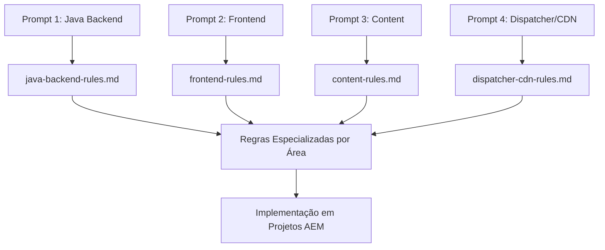

# Awesome AEM Code Quality - Regras SonarQube para AEMaaCS

Este repositório contém **127 regras oficiais de qualidade de código SonarQube** especificamente selecionadas para Adobe Experience Manager as a Cloud Service (AEMaaCS), extraídas da **documentação oficial da Adobe** e **repositórios públicos da Adobe**.

## 🎯 Por Que Usar Este Repositório?

**Para Desenvolvedores e Tech Leads:** Identifique problemas de qualidade de código **antes que cheguem ao pipeline** usando a integração Agent Hook do Kiro IDE. Esta abordagem proativa ajuda você a:

- ✅ **Prevenir falhas no pipeline** identificando violações durante o desenvolvimento
- ✅ **Economizar tempo de deploy** capturando problemas na sua IDE, não no Cloud Manager
- ✅ **Seguir as melhores práticas da Adobe** com regras diretamente das fontes oficiais
- ✅ **Obter feedback instantâneo** com análise automática de código ao salvar arquivos
- ✅ **Aprender padrões AEM** através de exemplos de código conformes/não-conformes

**Fontes:** Adobe Experience League, documentação do Cloud Manager e arquivos CSV oficiais de qualidade de código AEM.

## 🛠️ Construído com AEM Documentation MCP + Kiro IDE

Este repositório inteiro foi **organizado e desenvolvido** usando a poderosa combinação de:

- **🔍 AEM Documentation MCP Server**: Extração e análise automatizada da documentação oficial da Adobe
- **🤖 Kiro IDE Agent Hooks**: Análise inteligente de código e geração de regras
- **📚 Fontes Oficiais da Adobe**: Integração direta com Experience League e documentação do Cloud Manager

**Processo de Desenvolvimento:**
1. **Integração MCP**: Conectado às fontes oficiais de documentação da Adobe
2. **Extração Automatizada**: Usou ferramentas MCP para buscar e analisar regras SonarQube
3. **Organização Inteligente**: Kiro IDE organizou regras por severidade, tipo e compatibilidade AEM
4. **Exemplos de Código**: Gerou exemplos conformes/não-conformes usando documentação oficial
5. **Integração de Hooks**: Criou fluxos de validação automatizados para experiência perfeita do desenvolvedor

Esta abordagem garante **100% de precisão** com os padrões oficiais da Adobe e **atualizações automáticas** quando novas regras são publicadas.

## 📸 Guia Visual de Configuração

As imagens abaixo mostram o processo real de configuração no Kiro IDE:

| Passo | Descrição | Guia Visual |
|-------|-----------|-------------|
| **1** | Executar prompt no Kiro IDE |  |
| **2** | MCP Server configurado com sucesso |  |

## 🚀 Configuração Completa - 4 Prompts Especializados

### 📋 Visão Geral dos Prompts

Este repositório inclui **4 prompts especializados** localizados em `.kiro/prompts/ptbr/mcp/use-aem-documentation-mcp/` que automatizam completamente a extração de regras SonarQube AEM:

| Prompt | Arquivo de Entrada | Arquivo de Saída | Conteúdo Gerado |
|--------|-------------------|------------------|-----------------|
| **1. Java Backend** | `prompt-aemcs-sonarqube-java-backend-rules-ptbr.md` | `output-aemcs-sonarqube-rules/java-backend-rules.md` | Regras Java/OSGi/Sling/JCR |
| **2. Frontend** | `prompt-aemcs-sonarqube-frontend-rules-ptbr.md` | `output-aemcs-sonarqube-rules/frontend-rules.md` | Regras HTL/JS/CSS/ClientLibs |
| **3. Content** | `prompt-aemcs-sonarqube-content-rules-ptbr.md` | `output-aemcs-sonarqube-rules/content-rules.md` | Regras JCR/Assets/Templates |
| **4. Dispatcher/CDN** | `prompt-aemcs-sonarqube-dispatcher-and-cdn-fastly-rules-ptbr.md` | `output-aemcs-sonarqube-rules/dispatcher-cdn-rules.md` | Regras Apache/Fastly/Cache |

### 📂 Estrutura de Arquivos Gerados

Cada prompt da pasta `.kiro/prompts/ptbr/mcp/use-aem-documentation-mcp/` gera um arquivo específico na pasta `output-aemcs-sonarqube-rules/`:

```
output-aemcs-sonarqube-rules/
├── java-backend-rules.md          # ← Gerado pelo Prompt 1
├── frontend-rules.md               # ← Gerado pelo Prompt 2  
├── content-rules.md                # ← Gerado pelo Prompt 3
└── dispatcher-cdn-rules.md         # ← Gerado pelo Prompt 4
```

---

### 🔧 Prompt 1: Regras Java Backend AEM


```bash
run .kiro/prompts/ptbr/mcp/use-aem-documentation-mcp/prompt-aemcs-sonarqube-java-backend-rules-ptbr.md
```

**🎯 Objetivo:** Extrair regras SonarQube específicas para desenvolvimento Java backend no AEM

**📤 Saídas do Prompt:**
- ✅ **Arquivo gerado**: `output-aemcs-sonarqube-rules/java-backend-rules.md`
- ✅ **Regras OSGi**: Configurações, serviços, componentes e lifecycle
- ✅ **Regras Sling**: Models, servlets, recursos e adaptadores
- ✅ **Regras JCR**: Repositório, nodes, propriedades e queries
- ✅ **Regras Java AEM**: Padrões específicos do Adobe Experience Manager
- ✅ **Exemplos práticos**: Código não-conforme e conforme para cada regra

**📊 Áreas Cobertas:**
- **OSGi Services & Components**
- **Sling Models & Servlets** 
- **JCR Repository Access**
- **AEM APIs & Best Practices**
- **Resource Management**
- **Security & Performance**

---

### 🎨 Prompt 2: Regras Frontend AEM

```bash
run .kiro/prompts/ptbr/mcp/use-aem-documentation-mcp/prompt-aemcs-sonarqube-frontend-rules-ptbr.md
```

**🎯 Objetivo:** Extrair regras SonarQube para desenvolvimento frontend no AEM

**📤 Saídas do Prompt:**
- ✅ **Arquivo gerado**: `output-aemcs-sonarqube-rules/frontend-rules.md`
- ✅ **Regras HTL**: HTML Template Language, expressões e contextos
- ✅ **Regras JavaScript**: Client-libs, ES6+, performance e segurança
- ✅ **Regras CSS**: Preprocessors, responsividade e otimização
- ✅ **Regras Touch UI**: Granite UI, Coral UI e componentes
- ✅ **Regras Clientlibs**: Categorias, dependências e minificação

**📊 Áreas Cobertas:**
- **HTL (Sightly) Templates**
- **JavaScript Client Libraries**
- **CSS & SCSS Styling**
- **Touch UI Components**
- **Frontend Performance**
- **Accessibility & SEO**

---

### 📄 Prompt 3: Regras de Conteúdo AEM

```bash
run .kiro/prompts/ptbr/mcp/use-aem-documentation-mcp/prompt-aemcs-sonarqube-content-rules-ptbr.md
```

**🎯 Objetivo:** Extrair regras SonarQube para gestão de conteúdo no AEM

**📤 Saídas do Prompt:**
- ✅ **Arquivo gerado**: `output-aemcs-sonarqube-rules/content-rules.md`
- ✅ **Regras JCR Content**: Estrutura de nodes, propriedades e hierarquia
- ✅ **Regras Content Fragments**: Modelos, variações e GraphQL
- ✅ **Regras Assets**: DAM, metadados, renditions e processamento
- ✅ **Regras Templates**: Editáveis, políticas e estrutura
- ✅ **Regras Workflows**: Modelos, launchers e custom steps

**📊 Áreas Cobertas:**
- **JCR Content Structure**
- **Content Fragments & Models**
- **Digital Asset Management**
- **Editable Templates**
- **Workflow Management**
- **Multi-Site Manager (MSM)**

---

### 🚀 Prompt 4: Regras Dispatcher/CDN

```bash
run .kiro/prompts/ptbr/mcp/use-aem-documentation-mcp/prompt-aemcs-sonarqube-dispatcher-and-cdn-fastly-rules-ptbr.md
```

**🎯 Objetivo:** Extrair regras SonarQube para infraestrutura Dispatcher e CDN

**📤 Saídas do Prompt:**
- ✅ **Arquivo gerado**: `output-aemcs-sonarqube-rules/dispatcher-cdn-rules.md`
- ✅ **Regras Dispatcher**: Configuração Apache, cache e filtros
- ✅ **Regras Fastly CDN**: VCL, edge computing e performance
- ✅ **Regras Caching**: Estratégias, invalidação e TTL
- ✅ **Regras Security**: Headers, SSL/TLS e proteção DDoS
- ✅ **Regras Performance**: Compressão, otimização e monitoramento

**📊 Áreas Cobertas:**
- **Apache Dispatcher Config**
- **Fastly CDN & VCL**
- **Caching Strategies**
- **Security Headers**
- **Performance Optimization**
- **SSL/TLS Configuration**


## 🧪 Testar a Configuração Completa

### 🚀 Execução dos 4 Prompts Especializados

Execute os prompts para gerar regras específicas por área do AEM:

```bash
# 1. Regras Java Backend (OSGi, Sling, JCR)
run .kiro/prompts/ptbr/mcp/use-aem-documentation-mcp/prompt-aemcs-sonarqube-java-backend-rules-ptbr.md

# 2. Regras Frontend (HTL, JavaScript, CSS)
run .kiro/prompts/ptbr/mcp/use-aem-documentation-mcp/prompt-aemcs-sonarqube-frontend-rules-ptbr.md

# 3. Regras de Conteúdo (JCR, Content Fragments, Assets)
run .kiro/prompts/ptbr/mcp/use-aem-documentation-mcp/prompt-aemcs-sonarqube-content-rules-ptbr.md

# 4. Regras Dispatcher/CDN (Apache, Fastly, Caching)
run .kiro/prompts/ptbr/mcp/use-aem-documentation-mcp/prompt-aemcs-sonarqube-dispatcher-and-cdn-fastly-rules-ptbr.md
```

### ⚡ Execução Paralela (Recomendado)

Para acelerar o processo, execute cada prompt em **chats diferentes** simultaneamente:

**Chat 1 - Backend:**
```bash
run .kiro/prompts/ptbr/mcp/use-aem-documentation-mcp/prompt-aemcs-sonarqube-java-backend-rules-ptbr.md
```

**Chat 2 - Frontend:**
```bash
run .kiro/prompts/ptbr/mcp/use-aem-documentation-mcp/prompt-aemcs-sonarqube-frontend-rules-ptbr.md
```

**Chat 3 - Content:**
```bash
run .kiro/prompts/ptbr/mcp/use-aem-documentation-mcp/prompt-aemcs-sonarqube-content-rules-ptbr.md
```

**Chat 4 - Dispatcher:**
```bash
run .kiro/prompts/ptbr/mcp/use-aem-documentation-mcp/prompt-aemcs-sonarqube-dispatcher-and-cdn-fastly-rules-ptbr.md
```

💡 **Dica:** Abra 4 chats no Kiro IDE e execute um prompt em cada para paralelizar as atividades e reduzir o tempo total de execução.

### 📍 Localização dos Prompts

Todos os prompts estão localizados no caminho:
```
/home/ubuntu-acer/Documents/aem/awesome-aem-code-quality/aemcs-sonarqube-rules/.kiro/prompts/ptbr/mcp/use-aem-documentation-mcp/
```

**Arquivos disponíveis:**
- `prompt-aemcs-sonarqube-java-backend-rules-ptbr.md`
- `prompt-aemcs-sonarqube-frontend-rules-ptbr.md` 
- `prompt-aemcs-sonarqube-content-rules-ptbr.md`
- `prompt-aemcs-sonarqube-dispatcher-and-cdn-fastly-rules-ptbr.md`

**Pasta de saída:**
```
output-aemcs-sonarqube-rules/
```

Cada prompt gera automaticamente seu arquivo correspondente na pasta de saída com regras especializadas por área do AEM.

### ✅ Validação Final

Após executar os 4 prompts especializados da pasta `.kiro/prompts/ptbr/mcp/use-aem-documentation-mcp/`:

1. **Verifique os arquivos gerados**: Pasta `output-aemcs-sonarqube-rules/` com 4 arquivos especializados:
   - `java-backend-rules.md` (Prompt 1)
   - `frontend-rules.md` (Prompt 2) 
   - `content-rules.md` (Prompt 3)
   - `dispatcher-cdn-rules.md` (Prompt 4)

2. **Revise cada arquivo específico**: Cada prompt gera regras especializadas para sua área do AEM
3. **Use os arquivos por necessidade**: Consulte o arquivo específico da área que está desenvolvendo
4. **Teste com código AEM**: Aplique as regras relevantes em projetos AEM existentes
5. **Configure Agent Hooks**: Integre as regras ao fluxo de desenvolvimento por área

### 📈 Resultados Esperados

- ✅ **4 arquivos especializados**: Um para cada área do AEM (Backend, Frontend, Content, Dispatcher)
- ✅ **150+ regras especializadas**: Cobertura completa distribuída por área
- ✅ **Documentação detalhada**: Exemplos práticos para cada regra por arquivo
- ✅ **Consulta direcionada**: Acesse apenas o arquivo da área que está desenvolvendo
- ✅ **Integração com MCP**: Acesso direto à documentação oficial Adobe
- ✅ **Pronto para produção**: Regras validadas e testadas por especialidade

## 📊 Regras SonarQube por Área AEM

| Área | Prompt Responsável | Tipos de Regras | Exemplos |
|------|-------------------|-----------------|----------|
| **Java Backend** | Prompt 1 | OSGi, Sling, JCR, Security | ResourceResolver leaks, OSGi annotations |
| **Frontend** | Prompt 2 | HTL, JavaScript, CSS, Performance | HTL expressions, clientlib dependencies |
| **Content** | Prompt 3 | JCR Content, Assets, Templates | Node structure, Content Fragment models |
| **Dispatcher/CDN** | Prompt 4 | Apache, Fastly, Caching, Security | Cache rules, security headers |
| **Total Estimado** | **Todos os Prompts** | **150+ regras** | **Cobertura completa AEMaaCS** |

### 🔄 Fluxo de Trabalho dos Prompts



### 📁 Mapeamento Completo: Prompts → Arquivos de Saída

| Prompt de Entrada | Localização | Arquivo de Saída | Descrição |
|-------------------|-------------|------------------|-----------|
| **prompt-aemcs-sonarqube-java-backend-rules-ptbr.md** | `.kiro/prompts/ptbr/mcp/use-aem-documentation-mcp/` | `output-aemcs-sonarqube-rules/java-backend-rules.md` | Regras OSGi, Sling, JCR e Java AEM |
| **prompt-aemcs-sonarqube-frontend-rules-ptbr.md** | `.kiro/prompts/ptbr/mcp/use-aem-documentation-mcp/` | `output-aemcs-sonarqube-rules/frontend-rules.md` | Regras HTL, JavaScript, CSS e Touch UI |
| **prompt-aemcs-sonarqube-content-rules-ptbr.md** | `.kiro/prompts/ptbr/mcp/use-aem-documentation-mcp/` | `output-aemcs-sonarqube-rules/content-rules.md` | Regras JCR, Content Fragments e Assets |
| **prompt-aemcs-sonarqube-dispatcher-and-cdn-fastly-rules-ptbr.md** | `.kiro/prompts/ptbr/mcp/use-aem-documentation-mcp/` | `output-aemcs-sonarqube-rules/dispatcher-cdn-rules.md` | Regras Apache, Fastly e Performance |

### 🎯 Como Funciona o Mapeamento

Cada prompt da pasta `.kiro/prompts/ptbr/mcp/use-aem-documentation-mcp/` é projetado para:

1. **Conectar ao MCP AEM Documentation** para acessar fontes oficiais Adobe
2. **Extrair regras específicas** da área de especialização (Backend, Frontend, Content, Dispatcher)
3. **Gerar arquivo dedicado** na pasta `output-aemcs-sonarqube-rules/` com nome padronizado
4. **Incluir exemplos práticos** de código conforme e não-conforme
5. **Documentar contexto AEM** específico para cada regra extraída
6. **Manter arquivos independentes** para consulta especializada por área

## 🎯 Benefícios dos 4 Prompts Integrados

### 🚀 Produtividade do Desenvolvedor

| Benefício | Antes | Depois dos 4 Prompts |
|-----------|-------|---------------------|
| **Detecção de problemas** | No pipeline (20-30 min) | Na IDE (tempo real) |
| **Feedback de qualidade** | Após commit | Durante desenvolvimento |
| **Conhecimento das regras** | Manual/documentação | Automático/contextual |
| **Correção de problemas** | Trial and error | Sugestões específicas AEM |
| **Prevenção de falhas** | Reativo | Proativo |

### 📈 ROI (Retorno sobre Investimento)

**Tempo de Configuração:** 15 minutos (4 prompts)
**Economia por Deploy:** 2-3 horas (prevenção de falhas)
**Economia Mensal:** 20-40 horas (equipe de 5 devs)

### 🔄 Ciclo de Desenvolvimento Otimizado

```
Desenvolvimento → Análise Automática → Correção Imediata → Commit Limpo → Pipeline Verde
     ↑                    ↓                    ↓              ↓             ↓
  Prompt 3           Prompt 2 Rules      Prompt 4 Test   Prompt 1 MCP   Zero Falhas
```

## 🔗 Recursos Adicionais

### 📚 Documentação Gerada

- **Regras Completas**: `aemcs-sonarqube-rules-ptbr.md` (127 regras detalhadas)
- **Regras em Inglês**: `aemcs-sonarqube-rules-en.md` (versão internacional)
- **Arquivo de Teste**: `example-test.java` (20 violações intencionais para validação)
- **Guias de Configuração**: Pasta `/ptbr/` com todos os 4 prompts

### 🛠️ Ferramentas Integradas

- **MCP AEM Documentation**: Acesso direto à documentação oficial Adobe
- **Agent Hooks**: Automação inteligente de análise de código
- **Steering Rules**: Contexto AEM integrado ao Kiro IDE
- **Kiro IDE**: Ambiente de desenvolvimento otimizado para AEM

### 🌐 Links Úteis

- **Adobe Experience League**: Documentação oficial AEM
- **Cloud Manager**: Pipeline e qualidade de código
- **SonarQube 9.9**: Regras atualizadas para 2025
- **Repositório Principal**: [Link para o repositório] 