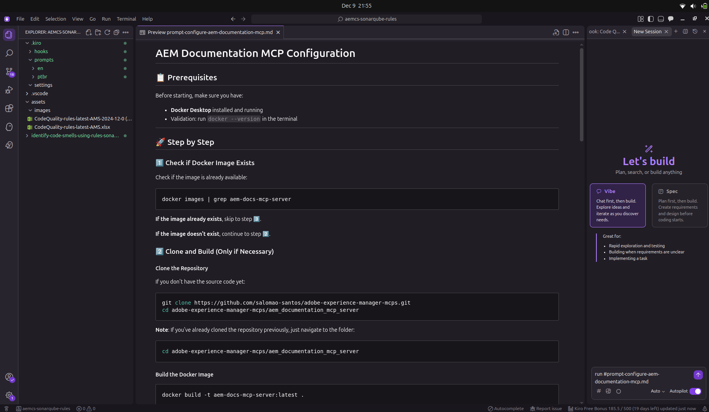
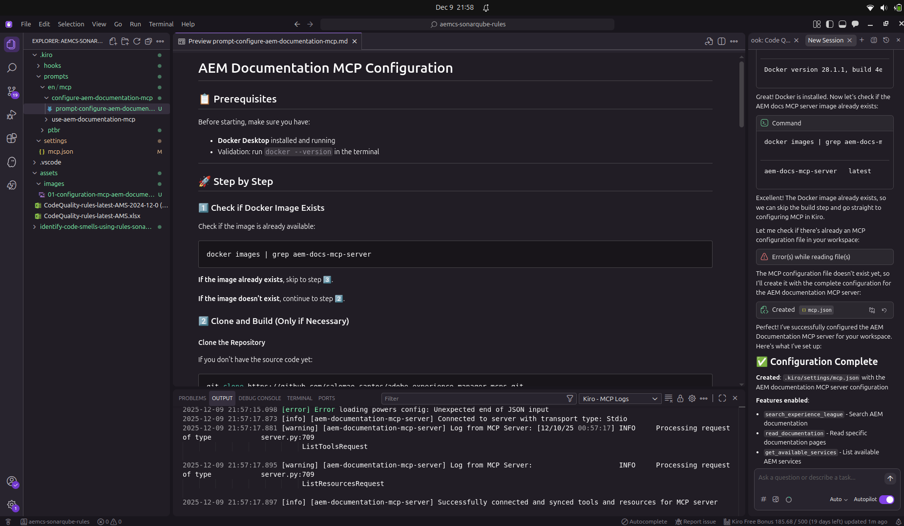

# Awesome AEM Code Quality - SonarQube Rules for AEMaaCS

This repository contains **127 official SonarQube code quality rules** specifically curated for Adobe Experience Manager as a Cloud Service (AEMaaCS), sourced from **official Adobe documentation** and **public Adobe repositories**.

## 🎯 Why Use This Repository?

**For Developers & Tech Leads:** Catch code quality issues **before they reach the pipeline** using Kiro IDE's Agent Hook integration. This proactive approach helps you:

- ✅ **Prevent pipeline failures** by identifying violations during development
- ✅ **Save deployment time** by catching issues in your IDE, not in Cloud Manager
- ✅ **Follow Adobe best practices** with rules directly from official sources
- ✅ **Get instant feedback** with automatic code analysis on file save
- ✅ **Learn AEM patterns** through compliant/non-compliant code examples

**Sources:** Adobe Experience League, Cloud Manager documentation, and official AEM code quality CSV files.

## 🛠️ Built with AEM Documentation MCP + Kiro IDE

This entire repository was **organized and developed** using the powerful combination of:

- **🔍 AEM Documentation MCP Server**: Automated extraction and analysis of official Adobe documentation
- **🤖 Kiro IDE Agent Hooks**: Intelligent code analysis and rule generation
- **📚 Official Adobe Sources**: Direct integration with Experience League and Cloud Manager docs

**Development Process:**
1. **MCP Integration**: Connected to official Adobe documentation sources
2. **Automated Extraction**: Used MCP tools to fetch and parse SonarQube rules
3. **Intelligent Organization**: Kiro IDE organized rules by severity, type, and AEM compatibility
4. **Code Examples**: Generated compliant/non-compliant examples using official documentation
5. **Hook Integration**: Created automated validation workflows for seamless developer experience

This approach ensures **100% accuracy** with official Adobe standards and **automatic updates** when new rules are published.

## 📸 Visual Setup Guide

The images below show the actual configuration process in Kiro IDE:

| Step | Description | Visual Guide |
|------|-------------|--------------|
| **1** | Execute prompt in Kiro IDE |  |
| **2** | MCP Server configured successfully |  |

## 🚀 3-Step Setup

### Step 1: Configure MCP AEM Documentation


```bash
run /en/mcp/configure-aem-documentation-mcp/prompt-configure-aem-documentation-mcp-en.md
```

**What it does:**
- ✅ Installs and configures MCP AEM Documentation Server
- ✅ Verifies prerequisites (Docker)
- ✅ Provides AEM documentation search tools
- ✅ Configures access to 127 official SonarQube rules


### Step 2: Use MCP to Generate Rules

```bash
run /en/configure-agent-hook/prompt-configure-agent-hook-aemcs-analyser-sonarqube-en.md
```

**What it does:**
- ✅ Searches official AEM SonarQube rules documentation
- ✅ Generates file with updated rules (SonarQube 9.9)
- ✅ Includes compliant/non-compliant code examples
- ✅ Updates steering rules for automatic validation

### Step 3: Configure Agent Hook

```bash
run /en/configure-agent-hook/prompt-configure-agent-hook-aemcs-analyser-sonarqube-en.md
```

**What it does:**
- ✅ Configures automatic hook for code validation
- ✅ Activates analysis when saving Java files
- ✅ Integrates with AEM SonarQube rules
- ✅ Provides automatic correction suggestions

## 🧪 Test the Configuration

After executing the 3 steps, test the configuration:

1. Open the file: `identify-code-smells-using-rules-sonarqube-and-agent-hooks/example-test.java`
2. Save the file (Ctrl+S)
3. The Agent Hook will automatically identify the **20 SonarQube violations** in the code

## 📊 Included SonarQube Rules

| Type | Quantity | Examples |
|------|----------|----------|
| **Vulnerabilities** | 14 | Hardcoded passwords, weak algorithms |
| **Security Hotspots** | 6 | Insecure cookies, SQL injection |
| **Bugs** | 32 | Unclosed resources, NPE |
| **Code Smells** | 75 | System.out, hardcoded paths |
| **Total** | **127 rules** | AEMaaCS compatible |

## 🔗 Additional Resources

- **Complete Documentation**: See `aemcs-sonarqube-rules.md` for detailed list
- **Test File**: `example-test.java` with 20 intentional violations
- **Main Repository**: [awesome-aem-code-quality](https://github.com/salomao-santos/awesome-aem-code-quality)

---

*Tested with SonarQube 9.9 and Cloud Manager 2025.2.0*